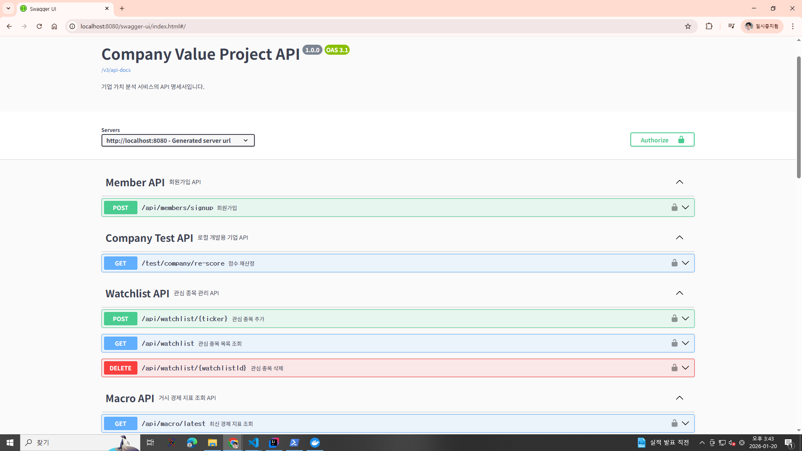
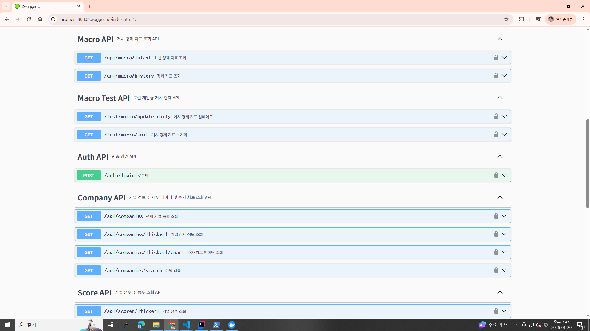

<div align="center">

# 📈 기업 가치 평가 & 거시 경제 분석 플랫폼 (Value Pick)

**"시장(Macro)과 기업(Micro)을 결합해 정보를 제공하는 입체적 투자 인사이트"**

</div>

- 기업 재무제표와 거시 경제 지표(금리, 실업률 등)를 종합 분석하여 장기 투자 적합성을 평가하는 풀스택 웹 애플리케이션입니다.

- 프로젝트 기간: '2025.11.17 ~ 2025.12.03(2주)'

## 📅 업데이트 로그

배포 이후에도 지속적인 성능 개선 및 리팩토링을 진행하고 있습니다.

> 2025.12.03  
 최초 배포
 ---
> 2025.12.10  
swagger 구현  
 기업 상세 페이지에 경제 및 회계 용어 모달 창 구현  
F등급 제도를 폐지하고, 대신 페널티를 강화  
분석 리포트 레이아웃 수정  
기업 목록 정렬 순서의 기본 설정을 점수순으로 수정
---

## 📝 프로젝트 개요

- 단순히 주가를 보여주는 것을 넘어, 기업 재무상태와 시장 상황을 바탕으로 사용자에게 다각화된 투자 인사이트를 제공합니다.
- 미국 주식 시장 데이터를 기반으로 기업의 **재무 건전성을 100점 만점으로 스코어링**하며, 경기 침체 시그널(장단기 금리차 역전 등) 발생 시 점수를 자동 차감하는 **동적 페널티 시스템**을 구현했습니다.

### 🎯 기획 의도

- **보수적 투자 가이드:** 재무적으로 탄탄한 기업도 경기 침체기에는 위험할 수 있다는 점에 착안, 거시 경제 지표를 평가 로직에 반영했습니다.
- **리스크 관리:** 부채가 과도하거나 자본 잠식 상태인 기업을 필터링하여 안전한 투자처를 제안합니다.

---

## 🛠 기술 스택 (Tech Stack)

### Backend

   
<br>
 

### Frontend

   
<br>
 

### Data & Infrastructure

  
<br>
 

---

## 🔗 배포 및 데모

- **Web URL:** http://34.69.43.90:8080
- **Demo Video:** `[유튜브 링크 업데이트 예정]`

> **⚠️ 서비스 이용 안내 (비용 최적화 정책)**
> 본 프로젝트는 학생 포트폴리오 용도로 운영되며, **API 비용 절감 및 Free Tier 제한(분당 5회)** 준수를 위해 다음과 같은 운영 정책을 적용 중입니다.
>
> 1. **GCP Free Tier:** 인스턴스 사양 제한으로 초기 로딩 시 약간의 지연이 발생할 수 있습니다.
> 2. **데이터 수집 제한:** API 쿼터 보호를 위해 전체 시장 데이터 대신 **대표 기업(AAPL)**에 대해서만 재무/주가 데이터를 갱신하고 있습니다.
> 3. **더미 데이터:** APPL을 제외한 기업은 시연을 위해 생성한 가상의 회사들이며, 최대한 현실 회사와 흡사하도록 분산 가중치를 주어 랜덤으로 재무 정보를 생성하는 로직을 구현했습니다.

---

## 💡 핵심 기능

### 1. 📊 기업 재무 건전성 스코어링

재무제표 3종을 분석하여 4대 지표를 산출합니다.

- **안정성 (40점):** 부채비율(금융업/비금융업 차등 적용), 영업활동 현금흐름
- **수익성 (30점):** ROE, 영업이익률
- **가치 (20점):** PER, PBR 기반 저평가 분석
- **미래 투자 (10점):** 매출액 대비 R&D 및 CapEx 비중

### 2. ⚠️ 동적 페널티 시스템 (Dynamic Penalty)

시장 리스크에 따라 기업 점수가 실시간으로 변동됩니다.

- **경기 침체 경고 (-10점):** 장단기 금리차(10Y-2Y) 역전 발생 시 전 기업 일괄 적용.
- **고금리 위험 투자 (-15점):** 금리 4% 이상 상황에서 고부채 기업의 무리한 투자 감지 시.

### 3. 🌏 거시 경제 대시보드

- 매일 아침 8시 업데이트되는 금리, 인플레이션, 실업률 추이 제공.
- **Red Zone Alert:** 차트 내 장단기 금리차 역전 구간을 붉게 표시하여 시장 위험 경고.

---

## 🚀 실행 방법 (Local)

**Docker Compose**를 통해 DB(MariaDB, Redis)와 애플리케이션을 한 번에 실행할 수 있습니다.

### 1. 환경 변수 설정

프로젝트 루트에 `.env` 파일을 생성합니다.

```env
DB_ROOT_PASSWORD=your_password
DB_NAME=value
```

### 2. 컨테이너 실행

```bash
# 백엔드 및 DB 실행
docker-compose up -d --build
```

### 3. 프론트엔드 실행

```bash
cd FRONT/companyvalue
npm install
npm run dev
```

- Frontend: `http://localhost:5173`
- Backend: `http://localhost:8080`

---
## API Reference


---

## 프로젝트 구조

```
company_value_project
├── BACK
│   └── companyvalue
│       ├── src/main/java/com/back
│       │   ├── domain          # 도메인별 비즈니스 로직 (DDD)
│       │   │   ├── auth        # 인증/인가
│       │   │   ├── company     # 기업, 재무, 점수, 주가
│       │   │   ├── macro       # 거시경제
│       │   │   ├── member      # 회원
│       │   │   ├── time        # 공통 시간 엔티티
│       │   │   └── watchlist   # 관심종목
│       │   ├── global          # 전역 설정 (Config, Error, Security)
│       │   └── infra           # 외부 인프라 (외부 API, 스케줄러)
│       └── resources           # 설정 파일 및 정적 리소스(React Build)
└── FRONT
    └── companyvalue
        ├── src
        │   ├── api             # Axios API 호출 정의
        │   ├── components      # 재사용 가능한 UI 컴포넌트
        │   ├── pages           # 라우트 페이지
        │   ├── stores          # Zustand 상태 관리
        │   └── types           # TypeScript 타입 정의
        └── public              # 정적 자산
```

## 👨‍💻 Developer

**alstn9213**
<br> - GitHub: [https://github.com/alstn9213](https://github.com/alstn9213)
<br> - Email: alstn9213@naver.com
